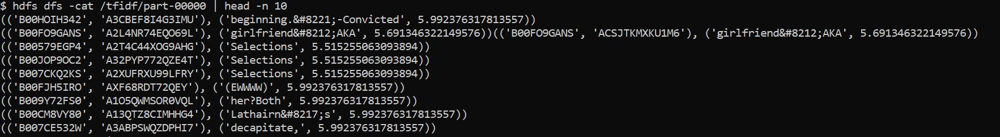

# Pre-requisites

1. Please use a Linux machine (64-bit) as the automation script relies on bash commands. WSL works too.
2. Access the following information via the Vocareum platform after logging into the AWS Educate website. Click on "Account Details" button and show the `AWS CLI`:
   - `aws_access_key`
   - `aws_secret_access_key`
   - `aws_session_token`

# Deployment Instructions

The deployment makes use of the Cloud Formation template to create a stack on AWS. The script is optimized to run in parallel.

1. `cd automation`
2. Start the deployment: `./main.sh -s`. You will be prompted in the following order:

   - AWS Access Key ID: `aws_access_key`
   - AWS Secret Access Key: `aws_secret_access_key`
   - Default region: us-east-1
   - Default output format: (not required)
   - AWS Session Token: `aws_session_token`
   - Desired stack name: (up to you)
   - Desired cluster size: (choose a number from 2 to 6)

3. The entire deployment takes about 10 minutes. Be patient!

# Troubleshooting

- If you made any typo error during keying in of information at the beginning, just `Ctrl-C` out of the script, and then run the teardown script (See Tear Down Instructions).
- To avoid errors in deployment, especially when you are reattempting `./main.sh -s` following a mistake/error, make sure you ran the teardown script beforehand.

- If you are facing `''$\r': command not found` errors:, refer to top-voted answer [here](https://askubuntu.com/questions/966488/how-do-i-fix-r-command-not-found-errors-running-bash-scripts-in-wsl).

# Post-Deployment

1. `logs.log` stores important information like the public IP addresses of the servers.

2. You can now access now the flask server remotely.

3. To run the analytics task, you can run: `./main.sh -a`.

   1. Time takes approximately 5 minutes. The performance is faster because we have installed Spark Cluster to run the analytics. Performance increases with number of nodes.

# Tear Down Instructions

1. `cd automation`
2. Start the teardown in root mode: `./main.sh -t`. You will be prompted in the following order (skip this step if your credentials have not expired because they are already saved in ~/.aws/credentials):

   - AWS Access Key ID: `aws_access_key`
   - AWS Secret Access Key: `aws_secret_access_key`
   - Default region: us-east-1
   - Default output format: (not required)
   - AWS Session Token: `aws_session_token`

# Analytics

To view the results after running analytics tasks:

1. Correlation

List out the output files from the task

```bash
hdfs dfs -ls /corr
```

View the last output file

```bash
hdfs dfs -cat /corr/part-00011
```

Results should look like this:


2. TF-IDF

List out the output files from the task

```bash
  hdfs dfs -ls /tfidf
```

View the files

```bash
hdfs dfs -cat /tfidf/part-00000
```

Results should look like this:


